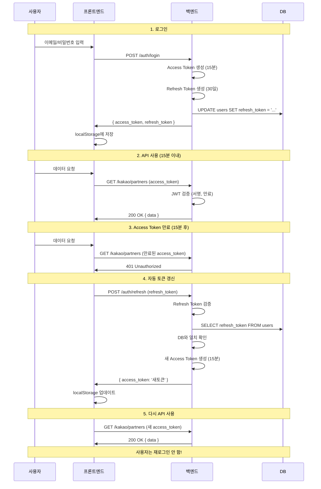

# JWT 인증 아키텍처 가이드

> 작성일: 2025-11-06
> 목적: JWT 인증 방식의 동작 원리와 서버 재시작 시 로그인 상태 유지 메커니즘 설명

---

## 📋 목차

1. [핵심 개념](#핵심-개념)
2. [JWT vs 전통적 세션](#jwt-vs-전통적-세션)
3. [서버 재시작과 로그인 상태](#서버-재시작과-로그인-상태)
4. [Refresh Token 동작 원리](#refresh-token-동작-원리)
5. [프론트엔드 저장 전략](#프론트엔드-저장-전략)
6. [실제 웹사이트 사례](#실제-웹사이트-사례)
7. [우리 프로젝트 적용](#우리-프로젝트-적용)

---

## 🎯 핵심 개념

### **백엔드의 역할**
```typescript
// 백엔드는 토큰만 발급
POST /auth/login
Response: {
  access_token: "eyJhbGc...",
  refresh_token: "eyJhbGc..."
}

// 저장 방식은 프론트엔드가 결정
// 로그인 유지 여부도 프론트엔드가 결정
```

### **프론트엔드의 역할**
```javascript
// 프론트엔드가 저장 위치 선택
if (로그인_상태_유지_체크) {
  localStorage.setItem('access_token', token);   // 영구 저장
} else {
  sessionStorage.setItem('access_token', token);  // 임시 저장
}
```

### **서버 재시작의 영향**
```
서버 재시작 (docker-compose restart, npm run start:dev)
   ↓
백엔드 메모리 초기화 (하지만 JWT는 stateless라서 상관없음)
   ↓
클라이언트의 토큰은 그대로 유지
   ↓
로그아웃 안 됨 ✅
```

---

## 🔄 JWT vs 전통적 세션

### **전통적 세션 방식 (Stateful)**

```typescript
// 서버 메모리에 세션 저장
const sessions = new Map();

// 로그인
POST /auth/login
→ sessions.set('session_abc123', { user_id: 'user-1', ... })
→ Response: Set-Cookie: session_id=abc123

// API 요청
GET /kakao/partners
Cookie: session_id=abc123
→ 서버: sessions.get('abc123') 조회
→ 사용자 확인

// 서버 재시작
npm run start:dev
→ sessions = new Map()  ← 메모리 초기화
→ 세션 삭제 ❌
→ 로그아웃됨!
```

**문제점:**
- ❌ 서버 재시작 시 세션 삭제
- ❌ 서버 확장 시 세션 동기화 필요 (Redis 등)
- ❌ 메모리 사용량 증가

---

### **JWT 방식 (Stateless)** ⭐

```typescript
// 서버는 아무것도 저장 안 함!

// 로그인
POST /auth/login
→ JWT 생성: {
    header: { alg: "HS256", typ: "JWT" },
    payload: {
      sub: "user-123",
      iat: 1704081600,  // 발급 시간
      exp: 1706673600   // 만료 시간
    },
    signature: "..."
  }
→ Response: { access_token: "eyJhbGc..." }

// API 요청
GET /kakao/partners
Headers: { Authorization: "Bearer eyJhbGc..." }
→ 서버: JWT 검증만 수행
  1. 서명 검증 (SECRET_KEY로)
  2. 만료 시간 확인
  3. payload에서 user_id 추출
→ 메모리 조회 없음!

// 서버 재시작
npm run start:dev
→ 서버 메모리: 비어있음 (원래부터)
→ 클라이언트 토큰: 그대로 유지
→ 로그아웃 안 됨! ✅
```

**장점:**
- ✅ 서버 재시작해도 로그인 유지
- ✅ 서버 확장 쉬움 (stateless)
- ✅ 메모리 사용 없음

**단점:**
- ❌ 토큰 무효화 어려움 (강제 로그아웃)
- ❌ 토큰 크기가 세션 ID보다 큼

---

## 🔍 서버 재시작과 로그인 상태

### **실제 시나리오**

#### **Day 1: 첫 로그인**
```bash
# 1. 서버 시작
docker-compose up -d
npm run start:dev

# 2. 로그인
POST /auth/login
Body: { email: "mingyu@test.com", password: "1234" }

Response: {
  access_token: "eyJhbGc...abc123",
  refresh_token: "eyJhbGc...xyz789"
}

# 3. 클라이언트(Postman/브라우저)에 저장
localStorage.setItem('access_token', 'eyJhbGc...abc123')
localStorage.setItem('refresh_token', 'eyJhbGc...xyz789')

# 4. API 사용
GET /kakao/partners
Headers: { Authorization: "Bearer eyJhbGc...abc123" }
→ 200 OK ✅

# 5. 컴퓨터 종료
→ 서버 종료
→ Postman/브라우저 종료
→ 하지만 localStorage는 디스크에 저장됨
```

#### **Day 2: 서버 재시작 후**
```bash
# 1. 컴퓨터 켜기 + 서버 시작
docker-compose up -d
npm run start:dev

# 2. Postman/브라우저 열기
→ localStorage에서 토큰 자동 로드
→ access_token: "eyJhbGc...abc123" (어제 것)
→ refresh_token: "eyJhbGc...xyz789" (어제 것)

# 3. 재로그인 없이 바로 API 사용!
GET /kakao/partners
Headers: { Authorization: "Bearer eyJhbGc...abc123" }  ← 어제 토큰

# 서버 검증 과정
→ JWT 디코딩: { sub: "user-123", exp: 1706673600 }
→ 서명 검증: SECRET_KEY로 확인 → ✅ 위조 안 됨
→ 만료 확인: exp(1월 31일) vs 현재(1월 2일) → ✅ 아직 유효
→ user_id = "user-123" 추출
→ 200 OK ✅

# 재로그인 안 해도 됨!
```

#### **서버를 100번 재시작해도**
```bash
→ 클라이언트의 토큰은 그대로 유지
→ 토큰 만료 시간은 변하지 않음 (JWT 자체에 포함)
→ 계속 정상 작동 ✅
```

---

## 🔐 Refresh Token 동작 원리

### **왜 Refresh Token이 필요한가?**

**Access Token만 사용하는 경우:**
```typescript
// 7일 유효 토큰
access_token: { exp: 7일 후 }

// 문제점
→ 토큰 탈취 시 7일간 악용 가능 ❌
→ 보안 위험 높음
```

**Access Token + Refresh Token 사용:**
```typescript
// Access Token: 15분 유효
access_token: { exp: 15분 후 }

// Refresh Token: 30일 유효
refresh_token: { exp: 30일 후 }

// 장점
→ 토큰 탈취 시 15분만 악용 가능 (피해 최소화)
→ 사용자는 30일간 재로그인 불필요 (편의성)
```

---

### **Refresh Token 플로우**



---

### **Refresh Token 저장 및 관리**

#### **로그인 시 (자동 생성)**
```typescript
// auth.service.ts
async login(email: string, password: string) {
  const user = await this.prisma.user.findUnique({ where: { email } });

  // 비밀번호 검증
  const isValid = await bcrypt.compare(password, user.password_hash);
  if (!isValid) throw new UnauthorizedException();

  // Access Token 생성 (15분)
  const accessToken = this.jwtService.sign(
    { sub: user.id },
    { expiresIn: '15m' }
  );

  // Refresh Token 생성 (30일)
  const refreshToken = this.jwtService.sign(
    { sub: user.id },
    { expiresIn: '30d' }
  );

  // DB에 Refresh Token 저장 (덮어쓰기)
  await this.prisma.user.update({
    where: { id: user.id },
    data: { refresh_token: refreshToken }
  });

  return {
    access_token: accessToken,
    refresh_token: refreshToken,
    user: { id: user.id, username: user.username }
  };
}
```

#### **서버 재시작 시**
```bash
# 서버 재시작
docker-compose restart
npm run start:dev

# DB 상태 (PostgreSQL)
SELECT refresh_token FROM users WHERE id = 'user-123';
→ "eyJhbGc...xyz789" (그대로 유지)

# 클라이언트 상태
localStorage.getItem('refresh_token')
→ "eyJhbGc...xyz789" (그대로 유지)

# 계속 사용 가능 ✅
```

#### **재로그인 시**
```typescript
// 사용자가 다시 로그인하면
POST /auth/login

// 새로운 Refresh Token 생성
const newRefreshToken = this.jwtService.sign(...);

// DB 업데이트 (덮어쓰기)
await this.prisma.user.update({
  data: { refresh_token: newRefreshToken }
});

// 이전 Refresh Token 무효화됨
// DB: refresh_token = "새토큰"
// 이전 토큰으로 /auth/refresh 요청 시 → 401 Unauthorized
```

---

### **Refresh Token 검증 과정**

```typescript
// auth.service.ts
async refresh(refreshToken: string) {
  try {
    // 1단계: JWT 자체 검증 (서명, 만료 시간)
    const payload = this.jwtService.verify(refreshToken, {
      secret: process.env.JWT_SECRET
    });
    // → 만료됐거나 서명이 틀리면 여기서 에러 발생

    // 2단계: DB에 저장된 것과 일치하는지 확인
    const user = await this.prisma.user.findUnique({
      where: { id: payload.sub }
    });

    if (user.refresh_token !== refreshToken) {
      throw new UnauthorizedException('Token has been revoked');
      // → 재로그인으로 덮어씌워진 경우
    }

    // 3단계: 새 Access Token 발급
    const newAccessToken = this.jwtService.sign(
      { sub: user.id },
      { expiresIn: '15m' }
    );

    return { access_token: newAccessToken };

  } catch (error) {
    throw new UnauthorizedException('Invalid refresh token');
  }
}
```

---

### **Refresh Token이 무효화되는 경우**

```typescript
// Case 1: 만료 (30일 후)
POST /auth/refresh (30일 지난 토큰)
→ jwtService.verify() → TokenExpiredError
→ 401 Unauthorized
→ 재로그인 필요

// Case 2: 재로그인으로 덮어씌워짐
POST /auth/login (새로운 로그인)
→ DB: refresh_token = "새토큰"
→ 이전 토큰으로 /auth/refresh 요청
→ DB 비교 실패 (불일치)
→ 401 Unauthorized

// Case 3: 로그아웃
POST /auth/logout
→ DB: refresh_token = null
→ 토큰으로 /auth/refresh 요청
→ DB 비교 실패 (null)
→ 401 Unauthorized

// Case 4: 서명 검증 실패
POST /auth/refresh (위조된 토큰)
→ jwtService.verify() → JsonWebTokenError
→ 401 Unauthorized
```

---

## 💾 프론트엔드 저장 전략

### **Storage 옵션 비교**

| Storage | 지속성 | 탭 간 공유 | 용량 | 보안 |
|---------|--------|-----------|------|------|
| `sessionStorage` | 브라우저 닫으면 삭제 | ❌ | 5-10MB | 중간 |
| `localStorage` | 영구 저장 | ✅ | 5-10MB | 중간 |
| `Cookie (httpOnly)` | 만료 시까지 | ✅ | 4KB | 높음 |
| `Memory` | 새로고침 시 삭제 | ❌ | 무제한 | 높음 |

---

### **방식 1: sessionStorage (일반 로그인)**

```javascript
// 로그인 처리
const handleLogin = async () => {
  const response = await fetch('/auth/login', {
    method: 'POST',
    body: JSON.stringify({ email, password })
  });

  const { access_token, refresh_token } = await response.json();

  // sessionStorage에 저장
  sessionStorage.setItem('access_token', access_token);
  sessionStorage.setItem('refresh_token', refresh_token);
};

// 브라우저 닫으면
→ sessionStorage 삭제됨
→ 다음 방문 시: 토큰 없음 → 재로그인 필요

// 사용 사례: 네이버, 다음 (기본 로그인)
```

---

### **방식 2: localStorage (자동 로그인)**

```javascript
// 로그인 처리
const handleLogin = async (keepLogin) => {
  const response = await fetch('/auth/login', {
    method: 'POST',
    body: JSON.stringify({ email, password })
  });

  const { access_token, refresh_token } = await response.json();

  if (keepLogin) {
    // localStorage에 저장 (영구)
    localStorage.setItem('access_token', access_token);
    localStorage.setItem('refresh_token', refresh_token);
  } else {
    // sessionStorage에 저장 (임시)
    sessionStorage.setItem('access_token', access_token);
    sessionStorage.setItem('refresh_token', refresh_token);
  }
};

// 브라우저 닫아도
→ localStorage는 유지됨
→ 다음 방문 시: 토큰 있음 → 자동 로그인 ✅

// 사용 사례: 네이버 ("로그인 상태 유지" 체크)
```

---

### **방식 3: httpOnly Cookie (가장 안전)**

```typescript
// 백엔드에서 쿠키 설정
@Post('auth/login')
async login(@Res() response: Response) {
  const { access_token, refresh_token } = await this.authService.login(...);

  // httpOnly 쿠키로 전송
  response.cookie('access_token', access_token, {
    httpOnly: true,  // JavaScript로 접근 불가 (XSS 방어)
    secure: true,    // HTTPS만
    sameSite: 'strict',  // CSRF 방어
    maxAge: 15 * 60 * 1000  // 15분
  });

  response.cookie('refresh_token', refresh_token, {
    httpOnly: true,
    secure: true,
    sameSite: 'strict',
    maxAge: 30 * 24 * 60 * 60 * 1000  // 30일
  });

  return response.json({ success: true });
}

// 프론트엔드는 토큰 저장 안 함
// 브라우저가 자동으로 쿠키 전송

// 장점: XSS 공격 방어 (JavaScript 접근 불가)
// 단점: CORS 설정 복잡
```

---

### **실제 구현 예시 (React)**

```javascript
// LoginPage.jsx
import { useState } from 'react';
import { useNavigate } from 'react-router-dom';

function LoginPage() {
  const [email, setEmail] = useState('');
  const [password, setPassword] = useState('');
  const [keepLogin, setKeepLogin] = useState(false);
  const navigate = useNavigate();

  const handleLogin = async (e) => {
    e.preventDefault();

    try {
      const response = await fetch('http://localhost:3000/auth/login', {
        method: 'POST',
        headers: { 'Content-Type': 'application/json' },
        body: JSON.stringify({ email, password })
      });

      if (!response.ok) {
        throw new Error('Login failed');
      }

      const { access_token, refresh_token } = await response.json();

      // 저장 위치 선택
      const storage = keepLogin ? localStorage : sessionStorage;
      storage.setItem('access_token', access_token);
      storage.setItem('refresh_token', refresh_token);

      // 대시보드로 이동
      navigate('/dashboard');

    } catch (error) {
      alert('로그인 실패: ' + error.message);
    }
  };

  return (
    <form onSubmit={handleLogin}>
      <h1>로그인</h1>

      <input
        type="email"
        placeholder="이메일"
        value={email}
        onChange={(e) => setEmail(e.target.value)}
        required
      />

      <input
        type="password"
        placeholder="비밀번호"
        value={password}
        onChange={(e) => setPassword(e.target.value)}
        required
      />

      <label>
        <input
          type="checkbox"
          checked={keepLogin}
          onChange={(e) => setKeepLogin(e.target.checked)}
        />
        로그인 상태 유지
      </label>

      <button type="submit">로그인</button>
    </form>
  );
}

export default LoginPage;
```

---

### **API 요청 시 토큰 자동 추가**

```javascript
// api.js (Axios 인터셉터)
import axios from 'axios';

const api = axios.create({
  baseURL: 'http://localhost:3000'
});

// 요청 인터셉터 (토큰 자동 추가)
api.interceptors.request.use((config) => {
  // sessionStorage와 localStorage 모두 확인
  const token = sessionStorage.getItem('access_token') ||
                localStorage.getItem('access_token');

  if (token) {
    config.headers.Authorization = `Bearer ${token}`;
  }

  return config;
});

// 응답 인터셉터 (401 시 자동 갱신)
api.interceptors.response.use(
  (response) => response,
  async (error) => {
    const originalRequest = error.config;

    // 401 에러이고, 재시도가 아닌 경우
    if (error.response?.status === 401 && !originalRequest._retry) {
      originalRequest._retry = true;

      try {
        // Refresh Token으로 갱신 시도
        const refreshToken = sessionStorage.getItem('refresh_token') ||
                            localStorage.getItem('refresh_token');

        const response = await axios.post('http://localhost:3000/auth/refresh', {
          refresh_token: refreshToken
        });

        const { access_token } = response.data;

        // 새 토큰 저장 (같은 위치에)
        if (sessionStorage.getItem('access_token')) {
          sessionStorage.setItem('access_token', access_token);
        } else {
          localStorage.setItem('access_token', access_token);
        }

        // 원래 요청 재시도
        originalRequest.headers.Authorization = `Bearer ${access_token}`;
        return api(originalRequest);

      } catch (refreshError) {
        // Refresh Token도 만료됨 → 로그인 페이지로
        sessionStorage.clear();
        localStorage.clear();
        window.location.href = '/login';
        return Promise.reject(refreshError);
      }
    }

    return Promise.reject(error);
  }
);

export default api;
```

---

## 🌐 실제 웹사이트 사례

### **1. 네이버 (Naver)**

```
기본 로그인:
  → sessionStorage 사용
  → 브라우저 닫으면 로그아웃

"로그인 상태 유지" 체크:
  → localStorage 사용
  → 30일간 유지
  → 다음 방문 시 자동 로그인
```

**구현 추정:**
```javascript
// 네이버 프론트엔드 (추정)
if (keepLogin) {
  localStorage.setItem('NID_AUT', access_token);
  localStorage.setItem('NID_SES', refresh_token);
} else {
  sessionStorage.setItem('NID_AUT', access_token);
}
```

---

### **2. Google**

```
기본 동작:
  → localStorage 사용
  → 영구 로그인 (만료 없음)
  → 로그아웃 버튼 눌러야만 로그아웃

보안:
  → httpOnly Cookie 병용
  → 2단계 인증
  → 의심스러운 활동 감지 시 재인증 요구
```

---

### **3. Facebook**

```
기본 동작:
  → localStorage 사용
  → 영구 로그인

추가 보안:
  → 새 기기 로그인 시 알림
  → 위치 기반 이상 탐지
```

---

### **4. 은행 사이트 (KB국민은행 등)**

```
기본 동작:
  → sessionStorage 사용
  → 10분 무활동 시 자동 로그아웃
  → 브라우저 닫으면 무조건 로그아웃

보안 강화:
  → 인증서 필수
  → OTP/보안카드
  → 중요 거래 시 추가 인증
```

**구현 추정:**
```javascript
// 은행 프론트엔드 (추정)
sessionStorage.setItem('token', access_token);

// 10분 타이머
let inactivityTimer;
const TIMEOUT = 10 * 60 * 1000; // 10분

const resetTimer = () => {
  clearTimeout(inactivityTimer);
  inactivityTimer = setTimeout(() => {
    sessionStorage.clear();
    alert('장시간 사용하지 않아 자동 로그아웃되었습니다.');
    window.location.href = '/login';
  }, TIMEOUT);
};

// 사용자 활동 감지
document.addEventListener('mousemove', resetTimer);
document.addEventListener('keypress', resetTimer);
```

---

### **5. GitHub**

```
기본 동작:
  → localStorage 사용
  → 영구 로그인

보안:
  → 민감한 작업 시 비밀번호 재확인
  → 예: Settings 변경, 저장소 삭제 등
```

---

## 🚀 우리 프로젝트 적용

### **Phase 1: 백엔드 구현 (현재)**

```typescript
// 백엔드는 토큰만 발급
// 저장 방식은 신경 안 씀

@Post('auth/login')
async login(@Body() loginDto: LoginDto) {
  const { access_token, refresh_token } =
    await this.authService.login(loginDto.email, loginDto.password);

  return {
    access_token,
    refresh_token,
    user: { ... }
  };
}

@Post('auth/refresh')
async refresh(@Body() refreshDto: RefreshDto) {
  const { access_token } =
    await this.authService.refresh(refreshDto.refresh_token);

  return { access_token };
}

@Get('auth/me')
@UseGuards(JwtAuthGuard)
async getMe(@Request() req) {
  return req.user;
}
```

---

### **Phase 2: Postman 테스트 (현재)**

```
1. 로그인
   POST http://localhost:3000/auth/login
   Body: { "email": "test@test.com", "password": "1234" }

   Response:
   {
     "access_token": "eyJhbGc...",
     "refresh_token": "eyJhbGc..."
   }

2. Environment Variable 저장
   ACCESS_TOKEN = eyJhbGc...
   REFRESH_TOKEN = eyJhbGc...

3. API 테스트
   GET http://localhost:3000/kakao/partners
   Headers: { "Authorization": "Bearer {{ACCESS_TOKEN}}" }

4. 서버 재시작해도
   → Postman Environment는 유지됨
   → 재로그인 불필요 ✅

5. 토큰 갱신 (15분 후)
   POST http://localhost:3000/auth/refresh
   Body: { "refresh_token": "{{REFRESH_TOKEN}}" }

   → 새 ACCESS_TOKEN 받음
   → Environment 업데이트
```

**Postman = 항상 localStorage처럼 동작**

---

### **Phase 3: 프론트엔드 구현 (미래)**

```javascript
// 네이버 스타일 구현
function LoginPage() {
  const [keepLogin, setKeepLogin] = useState(false);

  const handleLogin = async () => {
    const { access_token, refresh_token } = await loginAPI();

    if (keepLogin) {
      // "자동 로그인" 체크 시
      localStorage.setItem('access_token', access_token);
      localStorage.setItem('refresh_token', refresh_token);
    } else {
      // 일반 로그인
      sessionStorage.setItem('access_token', access_token);
      sessionStorage.setItem('refresh_token', refresh_token);
    }
  };

  return (
    <form onSubmit={handleLogin}>
      <input type="email" />
      <input type="password" />
      <label>
        <input
          type="checkbox"
          checked={keepLogin}
          onChange={(e) => setKeepLogin(e.target.checked)}
        />
        로그인 상태 유지
      </label>
      <button>로그인</button>
    </form>
  );
}
```

---

## 📊 요약 비교표

### **서버 재시작 영향**

| 인증 방식 | 서버 재시작 시 | 로그인 상태 |
|----------|---------------|------------|
| 세션 (Stateful) | 세션 삭제 | 로그아웃됨 ❌ |
| JWT (Stateless) | 영향 없음 | 로그인 유지 ✅ |

### **저장 위치별 특성**

| 저장 위치 | 브라우저 닫으면 | 사용 사례 |
|----------|----------------|----------|
| sessionStorage | 로그아웃됨 | 네이버 (일반) |
| localStorage | 로그인 유지 | 네이버 (자동), Google |
| httpOnly Cookie | 설정에 따라 | 은행 사이트 |
| Postman Env | 항상 유지 | 개발/테스트 |

### **Refresh Token 유무**

| 옵션 | Access Token | Refresh Token | 재로그인 주기 | 보안 |
|------|-------------|---------------|-------------|------|
| Option A | 7일 | ❌ 없음 | 7일마다 | 중간 |
| Option B | 15분 | ✅ 30일 | 30일마다 | 높음 |

---

## ✅ 핵심 정리

### **1. 백엔드의 역할**
```
✅ JWT 토큰만 발급
✅ 서명 검증 및 만료 확인
❌ 저장 방식은 관여 안 함
❌ 로그인 유지 여부는 관여 안 함
```

### **2. 프론트엔드의 역할**
```
✅ 토큰 저장 위치 결정 (sessionStorage vs localStorage)
✅ 로그인 유지 여부 결정 (체크박스)
✅ 토큰 만료 시 자동 갱신 (Refresh Token)
✅ 401 에러 시 재로그인 유도
```

### **3. 서버 재시작의 영향**
```
✅ JWT는 stateless → 서버 메모리 저장 안 함
✅ 클라이언트 토큰 그대로 유지
✅ 로그아웃 안 됨
✅ 재로그인 불필요
```

### **4. 재로그인이 필요한 경우**
```
✅ 토큰 만료 시 (7일 또는 30일 후)
✅ 토큰 분실 시 (캐시 삭제 등)
✅ DB 초기화 시
✅ 다른 계정 테스트 시
❌ 서버 재시작 시 (불필요)
```

---

## 🎓 학습 자료

### **JWT 공식 문서**
- https://jwt.io/
- https://datatracker.ietf.org/doc/html/rfc7519

### **NestJS JWT 가이드**
- https://docs.nestjs.com/security/authentication

### **보안 Best Practices**
- OWASP JWT Cheat Sheet
- https://cheatsheetseries.owasp.org/cheatsheets/JSON_Web_Token_for_Java_Cheat_Sheet.html

---

## 📝 다음 단계

이제 JWT 인증 시스템을 완전히 이해했으니:

1. ✅ DB 스키마 수정 (`users.name` 추가)
2. ✅ Auth Module 구현 (JWT 발급/검증)
3. ✅ 프론트엔드 연동 (나중에)

**구현 계획은 `docs/IMPLEMENTATION_PLAN.md`를 참고하세요!**
